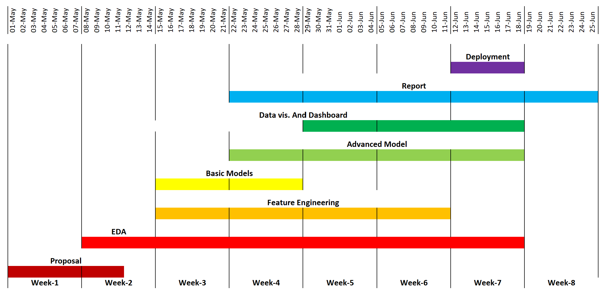

# Power Price Prediction
<h2 style="margin-top: -10px; padding-top: 0;">a short-term forecast</h2>

## Executive Summary
## Introduction
The electricity markets around the world have undergone a transformation from regulated to competitive and deregulated in the past few decades. Alberta's electricity market started deregulating in 1996, resulting in more volatile and uncertain power prices. This volatility makes accurate power price forecasting critical for businesses. In a deregulated market, the price series is more complex and volatile than the demand series. In Alberta's wholesale market for electricity, the price is determined through a uniform-price auction system. This project aims to forecast pool prices in a 12-hour-ahead window using the hourly published pool price.
This project has two key audiences. Firstly, it aims to broaden and deepen understanding of the subject through the technical products developed and the research study that supports it. Secondly, it aims to deliver tangible outcomes for potential clients of Slalom. Wholesale electricity consumers, traders, and generators can benefit from knowing the price ahead of time to increase efficiency in their decision-making. Government entities and regulators can also benefit from the project outcome as they monitor the market and enforce safe and reliable electricity supply.
The project intends to deliver three products: a model pipeline, a dashboard, and a report. The model pipeline will come with a confidence interval and all the scripts created for data cleaning, data wrangling, EDA, feature engineering, results, and evaluations. The dashboard will showcase real-time market price predictions and selected facts and informative data visualizations in a reactive and interactive way. The report will document studies regarding the electricity market mechanism in Alberta and how the model is developed. It may also consist of some purchasing recommendations for Slalom clients.
Overall, the deregulated electricity market in Alberta has made power price forecasting more challenging, but this project aims to deliver accurate forecasts to benefit businesses, government entities, and regulators. The technical products and research study can enhance the expertise and knowledge within the organization and deliver tangible outcomes for Slalom's clients.

## Data
# Explanatory Data Analysis
## Data Science Techniques
## Timeline
The project timeline is designed to ensure timely delivery. The first two weeks are allocated for proposal preparation, problem and data understanding, and initial EDA analysis. The primary workload will be during the four middle weeks, where focus will be on extended EDA analyses, feature engineering, model design and evaluation, data visualization, and dashboard development. Week 7 is reserved for product deployment, model refinement, bug fixing, and report finalization. Finally, week 8 is for wraping up, creating presentation and ensuring readiness for implementation by targeted audiences.

